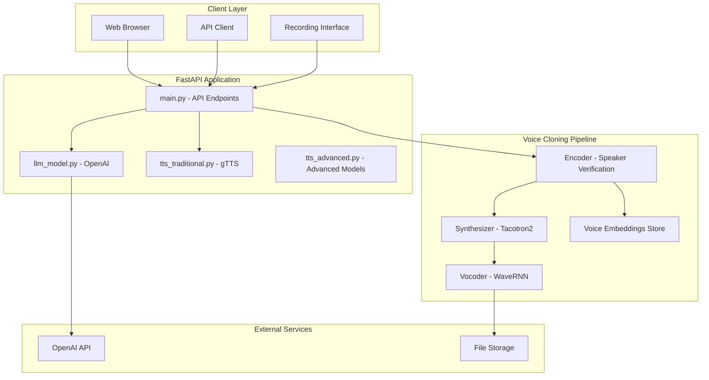
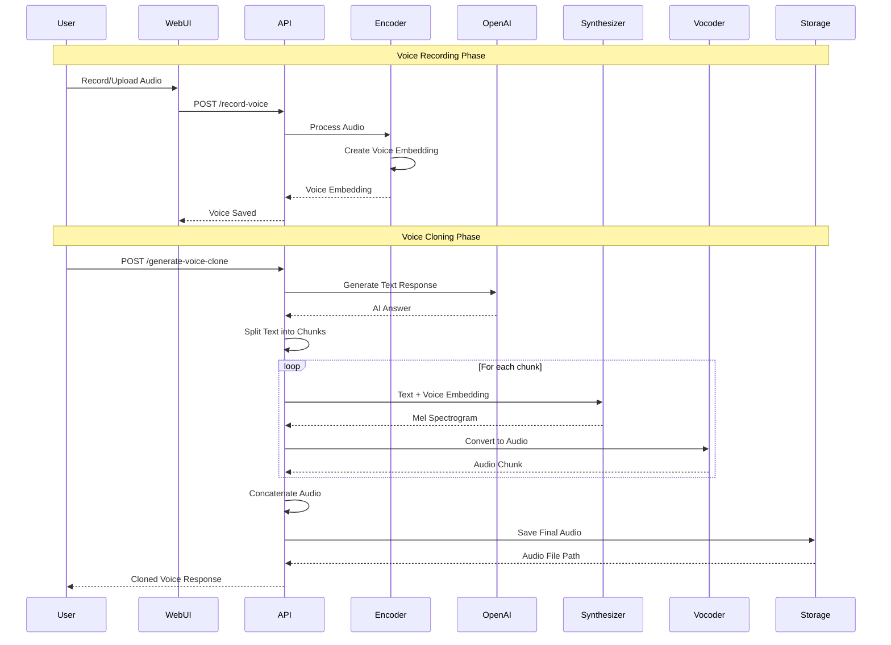
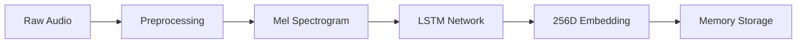
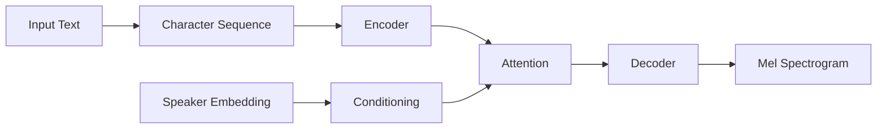
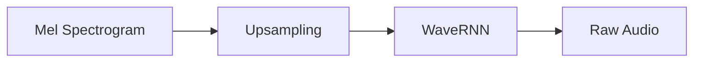
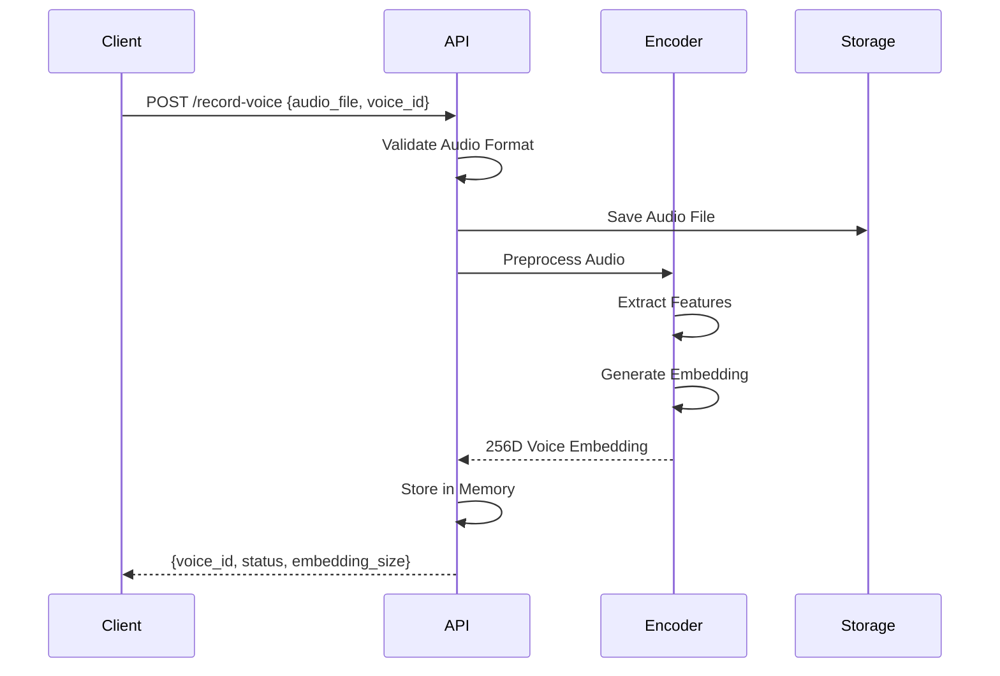
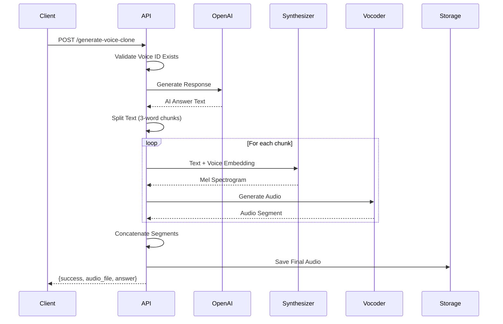
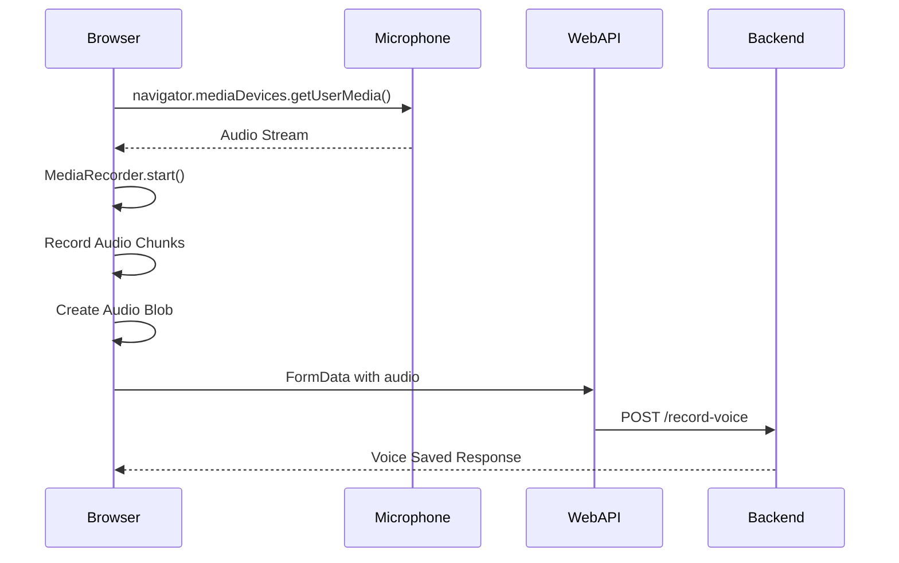
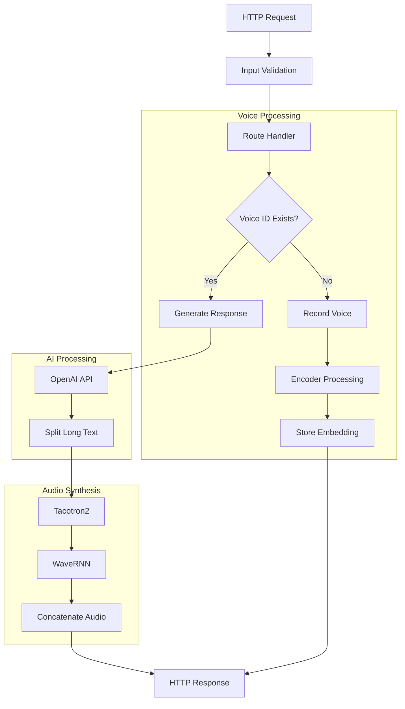

# AI Education Q&A Bot - Architecture with Voice Cloning

## System Overview

The AI Education Q&A Bot combines OpenAI LLM with real-time voice cloning using SV2TTS (Speaker Verification to Text-To-Speech) to provide intelligent, personalized audio responses.

## Core Architecture



## Voice Cloning Workflow



## Voice Cloning Components

### 1. Encoder (Speaker Verification)


**Purpose**: Convert voice samples into speaker embeddings
- **Input**: Raw audio (WAV, MP3, FLAC)
- **Output**: 256-dimensional speaker embedding
- **Model**: GE2E (Generalized End-to-End) loss trained LSTM

### 2. Synthesizer (Text-to-Speech)


**Purpose**: Generate mel spectrograms from text and speaker embedding
- **Input**: Text + Speaker embedding
- **Output**: Mel spectrogram
- **Model**: Tacotron2 with speaker conditioning

### 3. Vocoder (Audio Synthesis)


**Purpose**: Convert mel spectrograms to audio waveforms
- **Input**: Mel spectrogram
- **Output**: Audio waveform
- **Model**: WaveRNN for high-quality audio generation

## Request Workflows

### 1. Voice Recording Flow


### 2. Voice Cloning Generation Flow


### 3. Browser Recording Interface


## Data Flow Architecture



## File Structure with Voice Cloning

```
src/
├── scripts/
│   ├── main.py                 # FastAPI app with voice endpoints
│   ├── llm_model.py           # OpenAI integration
│   ├── tts_traditional.py     # Traditional TTS
│   └── tts_advanced.py        # Advanced TTS models
├── encoder/                   # SV2TTS Encoder
│   ├── inference.py          # Speaker embedding extraction
│   ├── model.py              # LSTM speaker encoder
│   └── audio.py              # Audio preprocessing
├── synthesizer/               # Tacotron2 Synthesizer
│   ├── inference.py          # Text-to-mel conversion
│   ├── models/               # Tacotron2 model
│   └── utils/                # Text processing utilities
├── vocoder/                   # WaveRNN Vocoder
│   ├── inference.py          # Mel-to-audio conversion
│   └── models/               # WaveRNN model
├── saved_models/              # Pre-trained models
│   └── default/
│       ├── encoder.pt        # Speaker encoder weights
│       ├── synthesizer.pt    # Tacotron2 weights
│       └── vocoder.pt        # WaveRNN weights
├── voices/                    # Stored voice files
└── outputs/                   # Generated audio files
```

## API Endpoints

| Endpoint | Method | Purpose | Input | Output |
|----------|---------|---------|-------|--------|
| `/record-interface` | GET | Recording UI | - | HTML Interface |
| `/record-voice` | POST | Save voice | Audio file + voice_id | Voice embedding |
| `/generate-voice-clone` | POST | Clone voice | Text + voice_id | Cloned audio |
| `/voices` | GET | List voices | - | Available voice IDs |
| `/ask` | POST | Standard Q&A | Question | Text response |
| `/download/{file}` | GET | Get audio | Filename | Audio file |

## Memory Management

### Voice Embeddings Storage
```python
# In-memory storage
voice_embeddings: Dict[str, np.ndarray] = {}

# Persistent storage (future enhancement)
def save_embeddings():
    with open('voice_embeddings.pkl', 'wb') as f:
        pickle.dump(voice_embeddings, f)
```

### Audio Processing Pipeline
- **Input**: Various audio formats (MP3, WAV, FLAC)
- **Preprocessing**: 16kHz sampling, noise reduction
- **Chunking**: 3-word segments for quality
- **Output**: High-quality WAV files

## Performance Optimizations

### Text Chunking Strategy
```python
def split_text_for_voice(text, max_words=3):
    # Split into small chunks for better voice quality
    # Prevents attention drift in long sequences
```

### Model Loading
- **Lazy Loading**: Models loaded on first use
- **GPU Support**: Automatic GPU detection
- **Memory Efficient**: Models shared across requests

## Deployment Architecture

### Docker Configuration
```yaml
services:
  ai-voice-bot:
    build: .
    ports:
      - "8000:8000"
    volumes:
      - ./voices:/app/voices      # Voice files
      - ./outputs:/app/outputs    # Generated audio
      - ./saved_models:/app/saved_models  # Model weights
    environment:
      - OPENAI_API_KEY=${OPENAI_API_KEY}
```

### Scaling Considerations
- **Stateless Design**: Voice embeddings in shared storage
- **Load Balancing**: Multiple FastAPI instances
- **Model Caching**: Shared model weights across containers

## Security & Privacy

### Voice Data Protection
- **Temporary Storage**: Voice files can be auto-deleted
- **Embedding Only**: Store embeddings, not raw audio
- **Access Control**: Voice ID-based permissions

### API Security
- **CORS Configuration**: Controlled origin access
- **Rate Limiting**: Prevent abuse
- **Input Validation**: Audio format verification